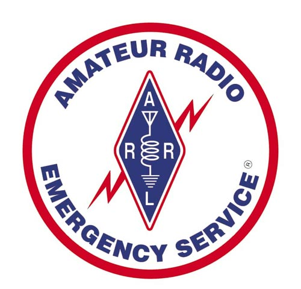

# Equipment

  

**Reviews and Field Notes**

Equipment choices for amateur radio span a wide range of price points, capabilities, and use cases. This section documents hands-on experience with radios, accessories, power systems, and field gear used by K5ANM across home station, portable, and emergency communications contexts. Reviews focus on practical performance — how equipment holds up in the field, in a deployed ARES net, or during a POTA activation — rather than spec-sheet comparisons alone.

---

*Content coming soon.*
