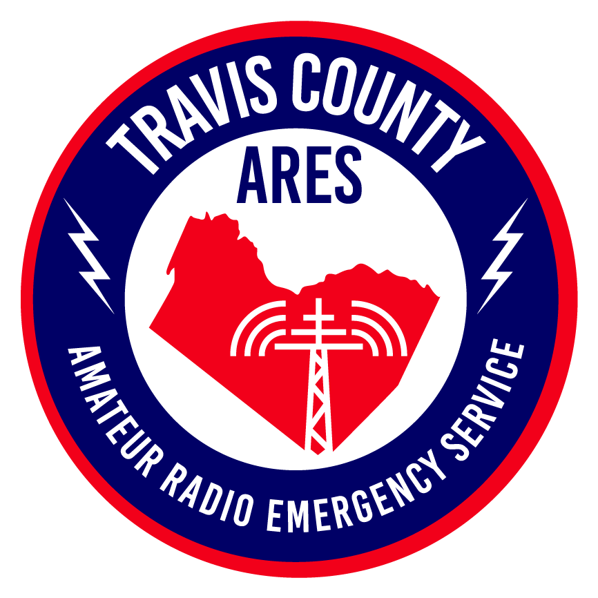

# K5ANM Amateur Radio

Welcome to the personal radio documentation site for **K5ANM**.

This site is a working reference for field operations, antenna projects, digital modes, and emergency communications. Use the navigation above to browse by topic.

---

  
  
  
  
  
  

---

## Quick Links

| Topic | Description |
|-------|-------------|
| [TCARES](tcares/index.md) | Travis County Amateur Radio Emergency Service |
| [RACES](races/index.md) | Radio Amateur Civil Emergency Service |
| [POTA](pota/index.md) | Parks on the Air activations and logs |
| [Antennas](antennas/index.md) | Build notes, measurements, and comparisons |
| [Programming](programming/index.md) | Radio programming guides by model |
| [Equipment](equipment/index.md) | Reviews and field notes |
| [Winlink](winlink/index.md) | Winlink setup, templates, and tips |
| [Field Day](field-day/index.md) | Planning, results, and lessons learned |
| [Resources](resources/index.md) | Downloads, references, and links |

---

*Site maintained by K5ANM. All content reflects personal experience and field observations.*
