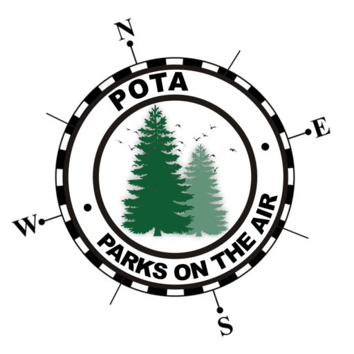

# POTA

  

**Parks on the Air**

Parks on the Air is an amateur radio program that encourages operators to make contacts from publicly accessible parks, nature areas, and protected lands. Each activation requires a minimum of ten contacts from a designated POTA location, rewarding both portable operating skill and a good excuse to get outdoors with a radio.

**K5ANM POTA Summary** *(as of June 2026)*

| Stat | Count |
|------|-------|
| Activations | 47 |
| Parks Activated | 40 |
| Activator QSOs | 1,510 |
| Parks Hunted | 441 |
| Hunter QSOs | 615 |
| Awards Earned | 20 |
| Endorsements | 60 |

This section documents K5ANM activations including park locations, equipment loadouts, antenna configurations, operating tips, and log summaries from Texas parks and beyond.
